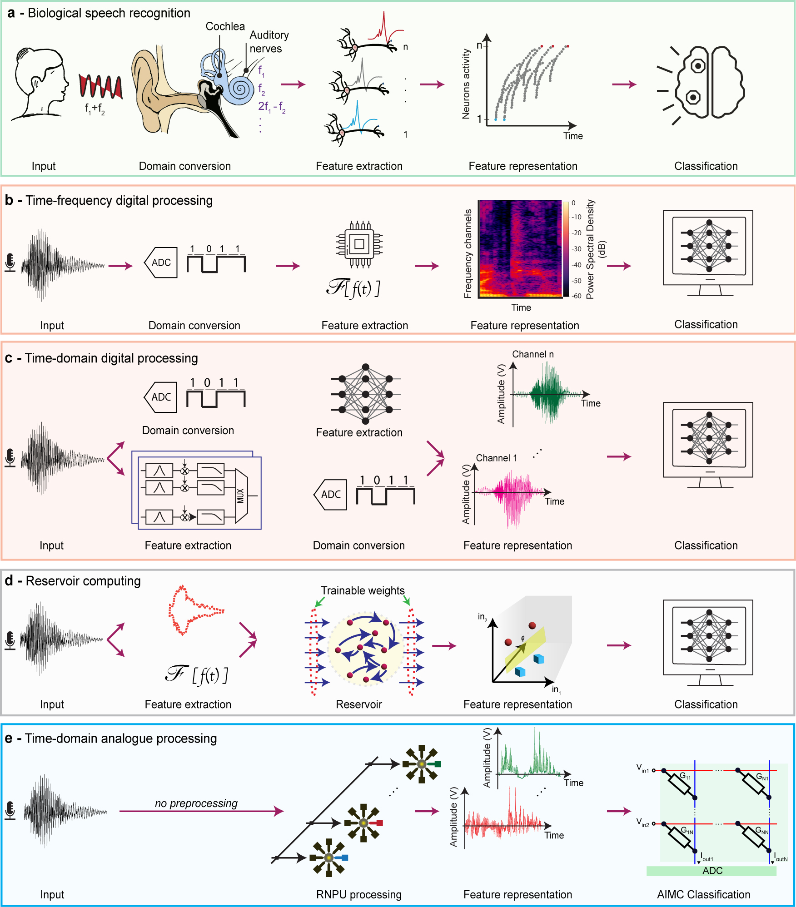

<figure style="text-align: center;">
  
  <figcaption>Figure 1: Overview of the mainstream speech recognition systems.</figcaption>
</figure>

# Analogue speech recognition based on physical computing

<!-- Simple overview of use/purpose. -->

## Description
This repository presents the codes and materials used for our ***Nature*** publication: https://doi.org/10.1038/s41586-025-09501-1

## Getting Started

### Dependencies

* You need a python environment with numpy==1.23.X, CUDA>=11.8, aihwkit_lightning==0.0.1 and some other libraries, such as scipy, tqdam, etc.

### Important note

* In order to reproduce the results, you need dataset(s). Please feel free to write to me if you are intrested to have access to both measured data and raw datasets that we used.

* For hardware training, you may face some erros steming from library version mismatches. This code works with aihwkit_lightning==0.0.1 I'm working on it to make the code compatible with the latest version. The code strucutre won't be changed.

### Installing

* No specific installations is required to run the code.

### Executing program

* Simply run each file.

## Authors

Mohamadreza Zolfagharinejad -- University of Twente
(m.zolfagharinejad@utwente.nl, mzolfaghari7493@gmail.com)

## Version History

* 0.1
    * Initial Release -- compatible with aihwkit_lightning == 0.0.1
  
* dev branch
    * Compatible with aihwkit_lightning versions == 2.0.1
